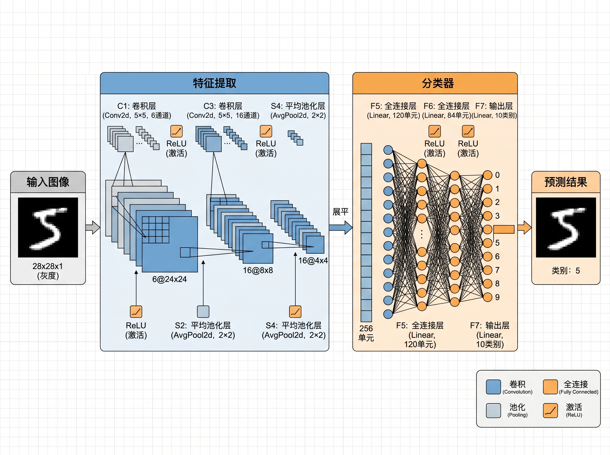

# LeNet-5（MNIST 手写数字识别）



## 实验目标

- 使用 LeNet-5 训练 MNIST（0-9）分类模型
- 完成训练、验证与结果可视化（曲线/混淆矩阵/样例推理）

## 环境配置

### 方式 1：conda（推荐）

```bash
conda env create -f environment.yml
conda activate cnn-lenet
```

### 方式 2：venv

```bash
python -m venv .venv
.\.venv\Scripts\Activate.ps1
python -m pip install -U pip
pip install -r requirements.txt
```

## 训练与验证

训练会自动下载 MNIST 到 `data/`。

```bash
python .\src\train.py --epochs 5 --batch-size 128 --lr 1e-3
```

CPU 训练：

```bash
python .\src\train.py --epochs 5 --cpu
```

如果你在某些 PowerShell/IDE 终端里 `conda activate cnn-lenet` 后仍提示找不到 `torch`，用下面方式启动最稳（不依赖激活）：

```bash
conda run -n cnn-lenet python .\src\train.py --epochs 5 --cpu
```

## 结果与可视化

每次运行会在 `/runs/时间戳/` 下生成训练与验证产物（例如曲线图、混淆矩阵、样例推理图、训练日志等），用于截图与写实验报告。

